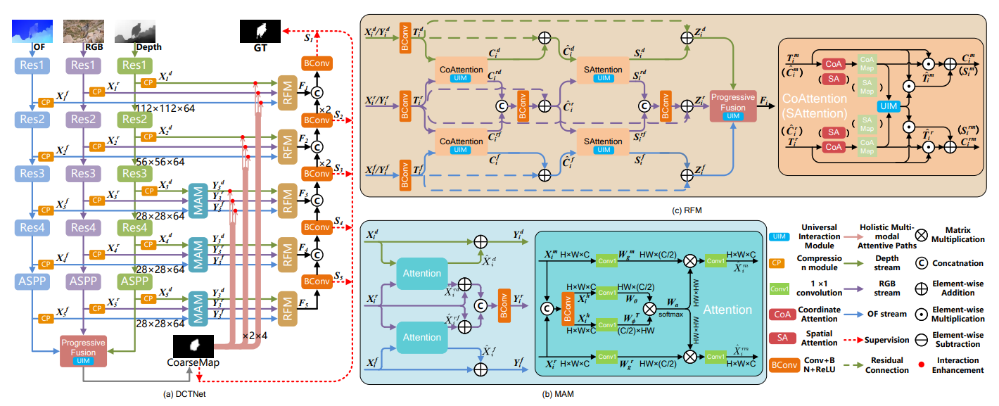
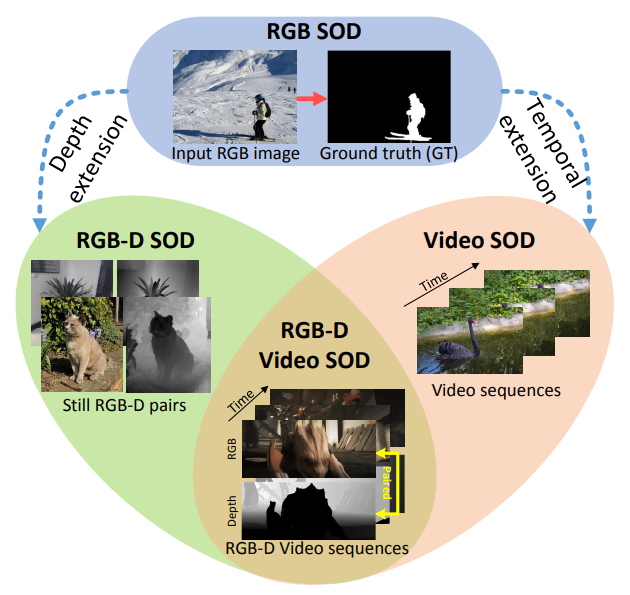

# DCTNet+: Salient Object Detection in RGB-D Videos

This repository provides PyTorch code implementation for DCTNet+: Salient Object Detection in RGB-D Videos [[Arxiv](https://arxiv.org/pdf/2202.06060.pdf)]

      
 <em> 
     Overview of DCTNet. (a) shows the big picture. (b) and (c) show the details of MAM and RFM, respectively.
    </em>

      
 <em> 
    Combination of RGB-D SOD and VSOD
    </em>

## Requirements

- Python 3.7
- Pytorch 1.6.0
- Torchvision 0.7.0
- Cuda 9.2
- Ubuntu16.04

## Usage

### Training

1. Download the pre_trained ResNet34 [backbone](https://download.pytorch.org/models/resnet34-333f7ec4.pth) to './model/resnet/pre_train/'.
2. Download the train dataset (containing DAVIS16, DAVSOD, FBMS and DUTS-TR) from [Baidu Driver](https://pan.baidu.com/s/1mVtAWJS0eC690nPXav2lwg) (PSW: 7yer) and save it at './dataset/train/*'. 
3. Following instructions of [RAFT](https://github.com/princeton-vl/RAFT) to prepare the optical flow and instructions of [DPT](https://github.com/isl-org/DPT) to prepare the synthetic depth map.(Both optical flow map and synthetic depth map are also available from our dataset link)
4. Download the pre_trained RGB, depth and flow stream models from [Baidu Driver](https://pan.baidu.com/s/1HptTP81LXANJ9W0Lu3XCQA) (PSW: 8lux) to './checkpoints/'.
5. The training of entire DCTNet is implemented on two NVIDIA TiTAN X GPUs. 
   - run `CUDA_VISIBLE_DEVICES=0,1 python -m torch.distributed.launch --nproc_per_node=2 train.py` in terminal

#### (PS: For pretraining different streams)
   - The pretraining code of different streams can be derived from `train.py`. We provide `pretrain_depth.py` and it can also be modified for pretraining the other two streams.  What is more, for RGB/spatial stream, we additionally use DUTS-TR for pretraining.

### Testing

1. Download the test data (containing DAVIS16, DAVSOD, FBMS, SegTrack-V2, VOS) from [Baidu Driver](https://pan.baidu.com/s/1u1qOWkv5WbovwWKogXwZQw) (PSW: 8uh3) and save it at './dataset/test/*'

2. Download the trained model from [Baidu Driver](https://pan.baidu.com/s/1Z8Sut8bOGOwbUBf0Tmhm4w) (PSW: lze1) and modify the  `model_path` to its saving path in the `test.py`.

3. Run `python test.py` in the terminal.

   

In addition to the one reported in the paper, we also provide different versions with two more training dataset-combos, including DAVIS + FBMS, and DAVIS + DAVSOD. 

### DAVIS + FBMS 

Models with "*" are traditional methods, MGAN and FSNet are trained and fine-tuned on DAVIS and FBMS. The comparison results are below. Download the trained model from [Baidu Driver](https://pan.baidu.com/s/12h5M639V59eLLEkJ3FcMFA) (PSW: l3q2)

| Datasets    | Metrics   | MSTM* | STBP* | SFLR* | SCOM* | MGAN      | FSNet | Ours      |
| ----------- | :-------- | ----- | ----- | ----- | ----- | --------- | ----- | --------- |
| DAVIS       | maxF      | 0.395 | 0.485 | 0.698 | 0.746 | 0.893     | 0.907 | **0.912** |
|             | S-measure | 0.566 | 0.651 | 0.771 | 0.814 | 0.913     | 0.920 | **0.924** |
|             | MAE       | 0.174 | 0.105 | 0.060 | 0.055 | 0.022     | 0.020 | **0.014** |
| DAVSOD      | maxF      | 0.347 | 0.408 | 0.482 | 0.473 | 0.662     | 0.685 | **0.691** |
|             | S-measure | 0.530 | 0.563 | 0.622 | 0.603 | 0.757     | 0.773 | **0.782** |
|             | MAE       | 0.214 | 0.165 | 0.136 | 0.219 | 0.079     | 0.072 | **0.068** |
| FBMS        | maxF      | 0.500 | 0.595 | 0.660 | 0.797 | **0.909** | 0.888 | **0.909** |
|             | S-measure | 0.613 | 0.627 | 0.699 | 0.794 | 0.912     | 0.890 | **0.916** |
|             | MAE       | 0.177 | 0.152 | 0.117 | 0.079 | 0.026     | 0.041 | **0.024** |
| SegTrack-V2 | maxF      | 0.526 | 0.640 | 0.745 | 0.764 | **0.840** | 0.806 | 0.826     |
|             | S-measure | 0.643 | 0.735 | 0.804 | 0.815 | **0.895** | 0.870 | 0.887     |
|             | MAE       | 0.114 | 0.061 | 0.037 | 0.030 | 0.024     | 0.025 | 0.034     |
| VOS         | maxF      | 0.567 | 0.526 | 0.546 | 0.690 | 0.743     | 0.659 | **0.764** |
|             | S-measure | 0.657 | 0.576 | 0.624 | 0.712 | 0.807     | 0.703 | **0.831** |
|             | MAE       | 0.144 | 0.163 | 0.145 | 0.162 | 0.069     | 0.103 | **0.061** |

### DAVIS + DAVSOD 

SSAV，PCSA and TENet are trained and fine-tuned on DAVIS and DAVSOD. The comparison results are below. Download the trained model from [Baidu Driver](https://pan.baidu.com/s/12Q3W56g3_F7REiKBsMgWGg) (PSW: srwu)

| Datasets    | Metrics   | MSTM* | STBP* | SFLR* | SCOM* | SSAV  | PCSA  | TENet | Ours      |
| ----------- | :-------- | ----- | ----- | ----- | ----- | ----- | ----- | ----- | --------- |
| DAVIS       | maxF      | 0.395 | 0.485 | 0.698 | 0.746 | 0.861 | 0.880 | 0.894 | **0.904** |
|             | S-measure | 0.566 | 0.651 | 0.771 | 0.814 | 0.893 | 0.902 | 0.905 | **0.917** |
|             | MAE       | 0.174 | 0.105 | 0.060 | 0.055 | 0.028 | 0.022 | 0.021 | **0.016** |
| DAVSOD      | maxF      | 0.347 | 0.408 | 0.482 | 0.473 | 0.603 | 0.656 | 0.648 | **0.695** |
|             | S-measure | 0.530 | 0.563 | 0.622 | 0.603 | 0.724 | 0.741 | 0.753 | **0.778** |
|             | MAE       | 0.214 | 0.165 | 0.136 | 0.219 | 0.092 | 0.086 | 0.078 | **0.069** |
| FBMS        | maxF      | 0.500 | 0.595 | 0.660 | 0.797 | 0.865 | 0.837 | 0.887 | 0.883     |
|             | S-measure | 0.613 | 0.627 | 0.699 | 0.794 | 0.879 | 0.868 | 0.910 | 0.886     |
|             | MAE       | 0.177 | 0.152 | 0.117 | 0.079 | 0.040 | 0.040 | 0.027 | 0.032     |
| SegTrack-V2 | maxF      | 0.526 | 0.640 | 0.745 | 0.764 | 0.798 | 0.811 | **    | **0.839** |
|             | S-measure | 0.643 | 0.735 | 0.804 | 0.815 | 0.851 | 0.866 | **    | **0.886** |
|             | MAE       | 0.114 | 0.061 | 0.037 | 0.030 | 0.023 | 0.024 | **    | **0.014** |
| VOS         | maxF      | 0.567 | 0.526 | 0.546 | 0.690 | 0.742 | 0.747 | **    | **0.772** |
|             | S-measure | 0.657 | 0.576 | 0.624 | 0.712 | 0.819 | 0.828 | **    | **0.837** |
|             | MAE       | 0.144 | 0.163 | 0.145 | 0.162 | 0.074 | 0.065 | **    | **0.058** |

## For evaluation:

1. The saliency maps of the SOTA methods in different fields on RDVS testing set (realistic depth map) can be download from [Baidu Driver](https://pan.baidu.com/s/10i5ADy4iSSwydy04Enf27w) (PSW: wfqc)
2. The saliency maps of the SOTA methods on RDVS testing set (synthetic depth map) can be download from [Baidu Driver] (https://pan.baidu.com/s/10i5ADy4iSSwydy04Enf27w) (PSW: wfqc)
3. The saliency maps of the SOTA methods on 5 benchmark datasets(DAVIS,DAVSOD,FBMS,SegTrack-V2,VOS) can be download from [Baidu Driver] (https://pan.baidu.com/s/10i5ADy4iSSwydy04Enf27w) (PSW: wfqc)
4. Evaluation Toolbox: We use the standard evaluation toolbox from [DAVSOD benchmark](https://github.com/DengPingFan/DAVSOD).

## Our new RGB-D VSOD dataset (RDVS):

We have constructed a new RGB-D VSOD dataset, whose depth is realistic, rather synthesized....

|**Year & Pub & Paper**|**Model**|**DAVIS**|**DAVSOD**|**FBMS**|**SegV2**|**VOS**|**ViSal**|**RDVS**|
| :-: | :-: | :-: | :-: | :-: | :-: | :-: | :-: | :-: | :-: | :-: |
|2008 & CVPR & [**PDB**](http://dpfan.net/wp-content/uploads/2008CVPR%E3%80%90PGFT%E3%80%91Spatio-temporal-Saliency-Detection-Using-Phase-Spectrum-of-Quaternion-Fourier-Transform.pdf)|[Code](http://dpfan.net/wp-content/uploads/2008-CVPR-PQFT.zip)|[Baidu ](https://pan.baidu.com/s/1T6RD6gDmZRhdqeMfIp2aMQ)\| Google|[Baidu ](https://pan.baidu.com/s/1Ab0ex7YK0cMgRHPbgkNiYw)\| Google|[Baidu ](https://pan.baidu.com/s/1xrLthuxOpw6t1rPG--x1xA)\| Google|[Baidu ](https://pan.baidu.com/s/1StnLc4X2LvOqG2DRet4jeA)\| Google|[Baidu ](https://pan.baidu.com/s/13g7RsXMmzYVL6_BBgZC5ow)\| Google|[Baidu ](https://pan.baidu.com/s/1MczGKR1inm8DySUVei-kDg)\| Google|[Baidu ](https://pan.baidu.com/s/1Lh-jnPdOPFu61NN2QPsgfw)\| Google|
|2009 & JOV & [**SST**](http://dpfan.net/wp-content/uploads/2009JOVSSTStatic-and-Space-time-Visual-Saliency-Detection-by-Self-Resemblance.pdf)|[Code](http://dpfan.net/wp-content/uploads/2009-JOV-SST.zip)|[Baidu ](https://pan.baidu.com/s/1TBVqzCB7c1sG2DHmyu-D4Q)\| Google|[Baidu ](https://pan.baidu.com/s/19GqLH1wYdFcvCXjXp7IsNA)\| Google|[Baidu ](https://pan.baidu.com/s/1arnIiFBV-gfoKdVpEl0miA)\| Google|[Baidu ](https://pan.baidu.com/s/1sS7YlS4lNAnX4WV5cGJFFQ)\| Google|[Baidu ](https://pan.baidu.com/s/1_ngJQfKK7ZKuJxte5cPq9Q)\| Google|[Baidu ](https://pan.baidu.com/s/1epAaC6GbCFkhGVq5mIJbsg)\| Google|
|2010 & ECCV & [**SIVM**](http://dpfan.net/wp-content/uploads/2010ECCVSIVSegmenting-Salient-Objects-from-Images-and-Videos.pdf)|Code|[Baidu](https://pan.baidu.com/s/12fYTWtuOTe1refKt_qkZUg) \| Google|[Baidu](https://pan.baidu.com/s/1YkCjHTLG910H0EijJIQjWQ) \| Google|[Baidu](https://pan.baidu.com/s/15tpcXdkcWtkQ2oeENBgP0w) \| Google|[Baidu](https://pan.baidu.com/s/1x9tjEPpeH1fQNjkn17Fh-w) \| Google|[Baidu](https://pan.baidu.com/s/1rVZC_aNmw99D_PyUZ548Wg) \| Google|[Baidu](https://pan.baidu.com/s/1OfgeBaVOy7vVo5jNcfjIHw) \| Google|[Baidu](https://pan.baidu.com/s/1Yl_bPRrTnnCjtA5Erbs88g) \| Google|
|2014 & CVPR & [**TIMP**](http://dpfan.net/wp-content/uploads/2014CVPRTIMPTime-Mapping-Using-Space-Time-Saliency.pdf)|[Code](http://dpfan.net/wp-content/uploads/2014-CVPR-TIMP.zip)|[Baidu ](https://pan.baidu.com/s/12XB0NlAX1fw8yxSOrSlvSg)\| Google|[Baidu ](https://pan.baidu.com/s/1UWWbFzoz9vUazQHdsFskGg)\| Google|[Baidu ](https://pan.baidu.com/s/1Xb4JfLDxf4uBMH6aLmi3gA)\| Google|[Baidu ](https://pan.baidu.com/s/1ys3Zju3GHwR64cNB19ZDew)\| Google|[Baidu ](https://pan.baidu.com/s/1z8XCcO79hEOe9zsRAimvAQ)\| Google|[Baidu ](https://pan.baidu.com/s/16aUN7UsBDPv7VP-rn6F1hw)\| Google|
|2014 & TCSVT & [SPVM](http://dpfan.net/wp-content/uploads/2014TCSVTSPSuperpixel-Based-Spatiotemporal-Saliency-Detection.pdf)|[Code](http://www.ivp.shu.edu.cn/Default.aspx?tabid=33430)|[Baidu](https://pan.baidu.com/s/1rYIOt79nsyLrDEIzvpKfeQ) \| Google|[Baidu ](https://pan.baidu.com/s/1-hjZ3OjRQlCZkTxd51uZ5A)\| Google|[Baidu](https://pan.baidu.com/s/1Vpc3ICd6j3lzBMaN1Ayl9A) \| Google|[Baidu](https://pan.baidu.com/s/1kLD9Qepc9ilHDLiuSnHJsw) \| Google|[Baidu](https://pan.baidu.com/s/1-4cvt4qOtoJk8Vl0-LaPDg) \| Google|[Baidu](https://pan.baidu.com/s/1-kuRgB4hUbFY8gqqEhV9_A) \| Google|[Baidu](https://pan.baidu.com/s/1YCPQ4_sDUomxEGjivO_j1w) \| Google|
|2015 & CVPR & [**SAG**](http://dpfan.net/wp-content/uploads/2015CVPRSAGSaliency-Aware-Geodesic-Video-Object-Segmentation.pdf)|[Code](http://dpfan.net/wp-content/uploads/2015-CVPR-SAG.zip)|[Baidu](https://pan.baidu.com/s/1JbKHX1LPnIxp8TzDys1H9Q) \| Google|[Baidu](https://pan.baidu.com/s/17sYQTV6i9fdapP61PJyL7w) \| Google|[Baidu](https://pan.baidu.com/s/19_nwWB9g9-4lo9sxkp_dMg) \| Google|[Baidu](https://pan.baidu.com/s/1nMvFloed3rIguxfN7HMMQQ) \| Google|[Baidu](https://pan.baidu.com/s/1u5BtxnNU5gdnV2qZgK5hpw) \| Google|[Baidu](https://pan.baidu.com/s/1dP1LS0pJUvk3j977wqvASA) \| Google|[Baidu](https://pan.baidu.com/s/1HR0p5lf__WTvhIvm45-Ozg) \| Google|
|2015 & TIP & [**GFVM**](http://dpfan.net/wp-content/uploads/2015TIPGFConsistent-Video-Saliency-Using-Local-Gradient-Flow-Optimization-and-Global-Refinement.pdf)|[Code](http://dpfan.net/wp-content/uploads/2015-TIP-GF.zip)|[Baidu ](https://pan.baidu.com/s/1slpDlCtxQYsINcofcYAF_Q)\| Google|[Baidu ](https://pan.baidu.com/s/1AuBa7R0Gyurpz1AkkXGQjw)\| Google|[Baidu ](https://pan.baidu.com/s/10JWi4u3xu-_xJTcM7w3kqw)\| Google|[Baidu ](https://pan.baidu.com/s/1aD0i8qEjygHCB5gfvdKchg)\| Google|[Baidu ](https://pan.baidu.com/s/1ltsWU251lhcMZBbJFlwBiA)\| Google|[Baidu ](https://pan.baidu.com/s/1fr7WfoO4LJOjXVCs3iJqMw)\| Google|[Baidu ](https://pan.baidu.com/s/1CngJSfTaMA-rTJE__Eu0UA)\| Google|
|2015 & TIP & [**RWRV**](http://dpfan.net/wp-content/uploads/2015TIPRWRVSpatiotemporal-Saliency-Detection-for-Video-Sequences-Based-on-Random-Walk-With-Restart.pdf)|[Code](http://dpfan.net/wp-content/uploads/2015-TIP-RWRV.zip)|[Baidu](https://pan.baidu.com/s/1OFk9VU-l4iKPO52Op_QQ9Q) \| Google|[Baidu ](https://pan.baidu.com/s/1m-Fc46vIC6jFFqoOhHsr2w)\| Google|[Baidu ](https://pan.baidu.com/s/14Gu3zwzOEKLabN8hfXzXsA)\| Google|[Baidu ](https://pan.baidu.com/s/1Php8bwSuyhQcizAbhZG_tQ)\| Google|[Baidu ](https://pan.baidu.com/s/1Q4Cx3P5MzLXzEe1sP3Q5bw)\| Google|[Baidu ](https://pan.baidu.com/s/1S1lK3ztwn7v8lkO3c9sJaA)\| Google|[Baidu ](https://pan.baidu.com/s/1DPfiZU_E3Hp5b25hCM2IYQ)\| Google|
|2015 & ICCV & [**MB+**](http://dpfan.net/wp-content/uploads/2015ICCVMBMinimum-Barrier-Salient-Object-Detection-at-80-FPS.pdf)|[Code](http://dpfan.net/wp-content/uploads/2015-ICCV-MB.zip)|[Baidu ](https://pan.baidu.com/s/10qwpbMWM34lU4sCx6aIGlw)\| Google|[Baidu ](https://pan.baidu.com/s/1ezk2LErJXl8FkHsxG-1hmg)\| Google|[Baidu ](https://pan.baidu.com/s/1REcf0wCn0BFdl--kgwhQwQ)\| Google|[Baidu ](https://pan.baidu.com/s/1NDPnHwgIvOXjJorvyNXmBQ)\| Google|[Baidu ](https://pan.baidu.com/s/1agZu8i-lAEny3a5d-qIwBg)\| Google|[Baidu ](https://pan.baidu.com/s/1QouyBqX9JBQr13IpkWIUdg)\| Google|[Baidu ](https://pan.baidu.com/s/1XaVROnM1T5IsffuRKd2H8g)\| Google|
|2016 & CVPR & [**MST**](http://dpfan.net/wp-content/uploads/2016CVPRMSTReal-Time-Salient-Object-Detection-with-a-Minimum-Spanning-Tree.pdf)|[Code](http://dpfan.net/wp-content/uploads/2016-CVPR-MST.zip)|[Baidu ](https://pan.baidu.com/s/1Iuw0m98VWN11RhrMBZhm5w)\| Google|[Baidu ](https://pan.baidu.com/s/1J5U3wYDc5rTf6o9y7TjR5Q)\| Google|[Baidu ](https://pan.baidu.com/s/1FVFoZ8yqvPvUbP00d19pwA)\| Google|[Baidu ](https://pan.baidu.com/s/13BxXddZABL3dOsy4PNdbLA)\| Google|[Baidu ](https://pan.baidu.com/s/1ZsXsOiL7bG25sv95qmcyWA)\| Google|[Baidu ](https://pan.baidu.com/s/1GZnT7kUzWKQfppHE_Yt_Ew)\| Google|[Baidu ](https://pan.baidu.com/s/1vubZMP07xzuVKqAf6G4Uig)\| Google|
|2017 & TCSVT & [**SGSP**](http://dpfan.net/wp-content/uploads/2017TCSVTSGSPSaliency-detection-for-unconstrained-videos-using-superpixel-level-graph-and-spatiotemporal-propagation.pdf)|[Code](http://dpfan.net/wp-content/uploads/2017-TCSVT-SGSP.zip)|[Baidu ](https://pan.baidu.com/s/1Gdbe6iA9xxHtCeqGqVB4jA)\| Google|[Baidu](https://pan.baidu.com/s/15oB6popPFXMSAfu7B4XjDg) \| Google|[Baidu](https://pan.baidu.com/s/19FcD5l0Q_D-Vsx3_0jRtTw) \| Google|[Baidu ](https://pan.baidu.com/s/113ud0kItXh4ymMWWGNgXJA)\| Google|[Baidu](https://pan.baidu.com/s/1aJp3rAwGNTprJ0InG3Bg_A) \| Google|[Baidu](https://pan.baidu.com/s/159yrO_NAYVJaj4vL-Wbptw) \| Google|[Baidu](https://pan.baidu.com/s/1f1JncdJt9Uw8pouzi2IH6Q) \| Google|
|2017 & TIP & [**SFLR**](http://dpfan.net/wp-content/uploads/2017TIPSFLRVideo-Saliency-Detection-via-Spatial-Temporal-Fusion-and-Low-Rank-Coherency-Diffusion.pdf)|[Code](http://dpfan.net/wp-content/uploads/2017-TIP-SFLR.zip)|[Baidu ](https://pan.baidu.com/s/13HsCPkj1inDRlFqlUvphPQ)\| Google|[Baidu ](https://pan.baidu.com/s/1iYo2CkUZ5uqTLGcCNzC_xQ)\| Google|[Baidu ](https://pan.baidu.com/s/1lKt0GOjo2iHK3cmcksjD-g)\| Google|[Baidu](https://pan.baidu.com/s/11tetJ9zGOPlXCaQG1hlPZA) \| Google|[Baidu](https://pan.baidu.com/s/1NCXwXT8yojQDhmT0eYWNRg) \| Google|[Baidu ](https://pan.baidu.com/s/1MFSbWwvaNPr1pXHMoiYhUQ)\| Google|[Baidu ](https://pan.baidu.com/s/1NL6Wh9ORdiADlSS9JwSbIA)\| Google|
|2017 & TIP & [**STBP**](http://dpfan.net/wp-content/uploads/2017TIPSTBPSalient-Object-Detection-with-Spatiotemporal-Background-Priors-for-Video.pdf)|[Code](http://dpfan.net/wp-content/uploads/2017-TIP-STBP.zip)|[Baidu](https://pan.baidu.com/s/1Rp-vjSsQmbGDVbSxzHix6w) \| Google|[Baidu](https://pan.baidu.com/s/1dXaXXBULN_UzN_uP_fQS7A) \| Google|[Baidu](https://pan.baidu.com/s/1XfazOGVf8JtyisREL5QBZw) \| Google|[Baidu](https://pan.baidu.com/s/1QUdtszAo-gyM-pHcl7MWkw) \| Google|[Baidu](https://pan.baidu.com/s/1xgmO_4MNZzR6LTZF_0sdsQ) \| Google|[Baidu](https://pan.baidu.com/s/15rgNIZE-J_U9wlpq5IfKig) \| Google|[Baidu](https://pan.baidu.com/s/1qeIHKGsnIFW1VO7Gye8m0A) \| Google|	
|2017 & TCYB & [**VSOP**](http://dpfan.net/wp-content/uploads/2018TCYBVSOPVideo-Saliency-Detection-Using-Object-Proposals.pdf)|Code|Baidu \| Google|[Baidu](https://pan.baidu.com/s/1LORMlb9GsbGVALIrg78BIA) \| Google|Baidu \| Google|[Baidu](https://pan.baidu.com/s/1-Y3NU2fNcZA8ah2FD6UZwA) \| Google|[Baidu](https://pan.baidu.com/s/19_3ExixqkmbHkHSrLmtQ3w) \| Google|Baidu \| Google|Baidu \| Google|Baidu \| Google|[Baidu](https://pan.baidu.com/s/1flgYj0wk3M4gyDRq-dN8Zg) \| Google|
|2017 & BMVC & [DSR3D](http://dpfan.net/wp-content/uploads/2017BMVCDSR3DDeeply-Supervised-3D-Recurrent-FCN-for-Salient-Object-Detection-in-Videos.pdf)|Code|[Baidu](https://pan.baidu.com/s/1aM_qg-ziV50RvKxIBksqpA) \| Google|Baidu \| Google|Baidu \| Google|[Baidu ](https://pan.baidu.com/s/1At3-EVrreq6_E0BjMZeZDA)\| Google|[Baidu ](https://pan.baidu.com/s/1_dZb4O_D_w-8NQs-bvnzBQ)\| Google|Baidu \| Google|Baidu \| Google|Baidu \| Google|[Baidu](https://pan.baidu.com/s/1GPksEm5qMMGkXkq9Q3lZMA) \| Google|
|2018 & TIP & [STCRF](http://dpfan.net/wp-content/uploads/2018TIPSTCRFVideo-Salient-Object-Detection-Using-Spatiotemporal-Deep-Features.pdf)|Code|[Baidu ](https://pan.baidu.com/s/1J2Mdjqm4AQ3V0fY_74mgHA)\| Google|Baidu \| Google|Baidu \| Google|[Baidu](https://pan.baidu.com/s/11DhzbVbBmzQDgibcqVuRBA) \| Google|[Baidu ](https://pan.baidu.com/s/1JzNghWK8cB5sFU-HzEH7-g)\| Google|Baidu \| Google|Baidu \| Google|Baidu \| Google|[Baidu ](https://pan.baidu.com/s/1C9DiAKewBlHjUe3h2A_AQA)\| Google|
|2018 & TIP & [**SCOM**](http://dpfan.net/wp-content/uploads/2018TIPSCOMSpatiotemporal-Constrained-Optimization-for-Salient-Object-Detection.pdf)|Code|[Baidu](https://pan.baidu.com/s/1Vf9O9q-ysCltwsNYP_y9NA) \| Google|[Baidu](https://pan.baidu.com/s/18kXmpovp1QzOwvw-LQ5GAQ) \| Google|[Baidu](https://pan.baidu.com/s/1bUy5-ZwCZijUSH3tfgGR7A) \| Google|[Baidu](https://pan.baidu.com/s/1jtkcsT1RXRsSFpGQMPIY6g) \| Google|[Baidu](https://pan.baidu.com/s/1GyyDG0bCjS9xHkPtuDEhXw) \| Google|[Baidu](https://pan.baidu.com/s/1Oed8jLGXWj9RAdhgweDxwg) \| Google|[Baidu](https://pan.baidu.com/s/18pNd6wu42obtDhbTnsklgQ) \| Google|
|2018 & TIP & [**DLVSD**](http://dpfan.net/wp-content/uploads/2018TIPDLVSDVideo-Salient-Object-Detection-via-Fully-Convolutional-Networks.pdf)|[Code](http://dpfan.net/wp-content/uploads/2018-TIP-DLVSD.zip)|[Baidu ](https://pan.baidu.com/s/19m8TOa5tvny8lBRAv66mbg)\| Google|[Baidu](https://pan.baidu.com/s/1ajSaTaNH2VVCo5MnKz_hdw) \| Google|[Baidu](https://pan.baidu.com/s/1igOKvOhz6F4jsAKyWLPiYA) \| Google|[Baidu ](https://pan.baidu.com/s/1WMkRg35GrO-YsZDQG4-_Fw)\| Google|[Baidu](https://pan.baidu.com/s/1eJQ_LPnSi8XvlLEmASvcKg) \| Google|[Baidu](https://pan.baidu.com/s/1VbcHq7m7dLGU4nf7qSWh9w) \| Google|
|2018 & TCSVT & SCNN|Code|[Baidu](https://pan.baidu.com/s/1I8XptKLIseyNG70vIC4YRA) \| Google|[Baidu](https://pan.baidu.com/s/1ozfR2QgGkrAxiloBAeABgw) \| Google|[Baidu](https://pan.baidu.com/s/1qvJiDmBQQFLyTuWNMd6oVg) \| Google|Baidu \| Google|Baidu \| Google|[Baidu](https://pan.baidu.com/s/1kkjigLljmXeWplNs8fPdEA) \| Google|[Baidu](https://pan.baidu.com/s/1h-EfXCWdZl1_dW7TwTmBzw) \| Google|[Baidu](https://pan.baidu.com/s/1-KbOoIKoNM3s34zZTCMOWQ) \| Google|[Baidu](https://pan.baidu.com/s/1LiNYmKOpi0FsxenBwDLQGg) \| Google|
|2018 & ECCV & MBNM|Code|[Baidu](https://pan.baidu.com/s/1lX1ZFUuaPAaMmTcIEaDMow) \| Google|[Baidu](https://pan.baidu.com/s/1x0hGn4p-kTqdzTqbr05icA) \| Google|[Baidu](https://pan.baidu.com/s/1FobuUPQefpgTGn4JOVRLGA) \| Google|Baidu \| Google|[Baidu](https://pan.baidu.com/s/160vf3OAwMqKvNhajH_19Aw) \| Google|[Baidu](https://pan.baidu.com/s/11QnwM2fR7osBMxjaeAjBRQ) \| Google|[Baidu](https://pan.baidu.com/s/1HHjX9XPAK8vnLBtV72YBoA) \| Google|[Baidu](https://pan.baidu.com/s/1ckC0yKs6UpHvKrws60S0Yw) \| Google|[Baidu](https://pan.baidu.com/s/1GKVnO4JoeTiHe-A88mY_yw) \| Google|
|2018 & ECCV & [**PDB**](http://dpfan.net/wp-content/uploads/2018ECCVPDBPyramid-Dilated-Deeper-CoonvLSTM-for-Video-Salient-Object-Detection.pdf)|[Code](https://github.com/wenguanwang/PDB-ConvLSTM)|[Baidu ](https://pan.baidu.com/s/1hdlr28VgOfEtdhiPCBpjPQ)\| Google|[Baidu ](https://pan.baidu.com/s/1Xqv69uOusFxbRSR1WknwmA)\| Google|[Baidu ](https://pan.baidu.com/s/11b6ZA8wrYnIsFJjPkrUciw)\| Google|[Baidu ](https://pan.baidu.com/s/1y-O8C5vGhoiW55F8Cf9PAA)\| Google|[Baidu ](https://pan.baidu.com/s/1JP98bXEq7goAhx-VIJ5B-g)\| Google|[Baidu ](https://pan.baidu.com/s/16DLO54iyFM9j0ksZrB3psg)\| Google|[Baidu](https://pan.baidu.com/s/1t8-Beq_0SNNqhkSTxJlgpw) \| Google|
|2018 & CVPR & [**FGRNE**](http://dpfan.net/wp-content/uploads/2018CVPRFGRNE-Flow-Guided-Recurrent-Neural-Encoder-for-Video-Salient-Object-Detection.pdf)|Code|[Baidu](https://pan.baidu.com/s/1FBj2wZwVAZZLoD0f6nun2Q) \| Google|[Baidu](https://pan.baidu.com/s/1pbU0PwKgJ2ZHIlSz2YcUAg) \| Google|[Baidu](https://pan.baidu.com/s/11fBUcVcdtyM2chZLOD33rA) \| Google|[Baidu](https://pan.baidu.com/s/1bnFPdiw1XrzCpEDnfKKJxQ) \| Google|[Baidu](https://pan.baidu.com/s/1QIc0DUr-SfOsL3c98EHr6g) \| Google|[Baidu](https://pan.baidu.com/s/1FXBd6_7g8UeF7C52Os77jQ) \| Google|[Baidu](https://pan.baidu.com/s/1Bu2VvjCYCl1-j1heJxxQdQ) \| Google|
|2019 & CVPR & [SSAV](http://openaccess.thecvf.com/content_CVPR_2019/papers/Fan_Shifting_More_Attention_to_Video_Salient_Object_Detection_CVPR_2019_paper.pdf)|[Code](https://github.com/DengPingFan/DAVSOD)|[Baidu](https://pan.baidu.com/s/1qHT4sQBz48TUglbTrJL-6A) \| Google|[Baidu](https://pan.baidu.com/s/1jnSfS-ca8DJ470Pr6z2Ixw) \| Google|[Baidu](https://pan.baidu.com/s/1qGwYaKvA8QDM1rCJDALaTg) \| Google|Baidu \| Google|[Baidu](https://pan.baidu.com/s/1nV-gPic6e5pdqpi51awb5w) \| Google|[Baidu](https://pan.baidu.com/s/1KuwzOFHWo9YUL4RLCk2THA) \| Google|[Baidu](https://pan.baidu.com/s/1kms8c-mgq7dPpkiaHRcIjA) \| Google|

